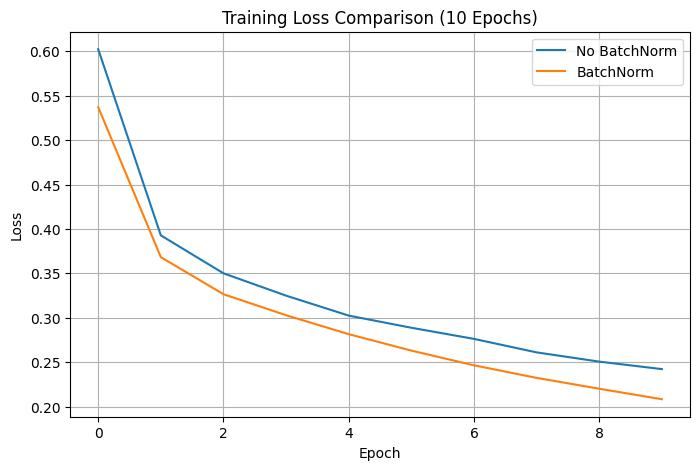

# CNN vs Transfer Learning & Batch Normalization using PyTorch

<p align="center">
  <b>A comparative deep learning study exploring the impact of Transfer Learning and Batch Normalization on image classification performance.</b>
</p>

---

## 📖 Project Overview

Deep learning models often require large datasets and significant computational resources to achieve high performance. This project investigates two widely adopted techniques that address these challenges:

- **Transfer Learning**
- **Batch Normalization**

Two independent experiments were conducted using PyTorch to analyze their effect on model accuracy, convergence speed, optimization stability, and training efficiency.

The objective of this project is to understand how modern deep learning techniques improve performance compared to conventional Convolutional Neural Networks (CNNs).
---

# 🏗️ Project Workflow

```
                     Deep Learning Comparative Study
                                  │
        ┌─────────────────────────┴─────────────────────────┐
        │                                                   │
        ▼                                                   ▼
Transfer Learning Project                    Batch Normalization Project
        │                                                   │
        ▼                                                   ▼
 Cats vs Dogs Dataset                         Fashion-MNIST Dataset
        │                                                   │
        ▼                                                   ▼
Data Preprocessing                           Data Preprocessing
        │                                                   │
        ▼                                                   ▼
 Model Training                              CNN Architectures
        │                                                   │
        ▼                                                   ▼
Performance Evaluation                    Performance Evaluation
        │                                                   │
        └─────────────────────────┬─────────────────────────┘
                                  ▼
                      Comparative Deep Learning Analysis
```
---

# 🚀 Experiments

## 📌 Experiment 1 — CNN vs Transfer Learning
### Workflow

```text
             Cats vs Dogs Mini Dataset
                       │
                       ▼
            Image Preprocessing
     (Resize → Tensor → Normalize)
                       │
                       ▼
                Dataset Preparation
                       │
      ┌────────────────┼─────────────────┐
      ▼                ▼                 ▼
 CNN From Scratch  Frozen ResNet18  Fine-Tuned ResNet18
      │                │                 │
      └────────────────┼─────────────────┘
                       ▼
                Model Evaluation
                       │
                       ▼
          Accuracy & Performance Analysis
```

This experiment compares three different approaches for binary image classification using the **Cats vs Dogs Mini Dataset**.

### Models Compared

- CNN trained completely from scratch
- Frozen ResNet18 (Feature Extraction)
- Fine-Tuned ResNet18

### Results

| Model | Validation Accuracy |
|--------|--------------------:|
| CNN from Scratch | 61.5% |
| Frozen ResNet18 | 97.0% |
| Fine-Tuned ResNet18 | **99.5%** |

### Key Findings

- Training a CNN from scratch on a small dataset leads to limited performance.
- Transfer Learning dramatically improves classification accuracy.
- Fine-Tuning the pretrained network achieves the highest overall performance.
  
### Accuracy Comparison

<p align="center">

</p>


---

## 📌 Experiment 2 — Batch Normalization Analysis

### Workflow

```text
              Fashion-MNIST Dataset
                      │
                      ▼
             Data Preparation
                      │
                      ▼
           CNN Architecture Design
                      │
        ┌─────────────┴─────────────┐
        ▼                           ▼
Without BatchNorm          With BatchNorm
        │                           │
        ▼                           ▼
     Train Models              Train Models
        │                           │
        └─────────────┬─────────────┘
                      ▼
         Loss & Accuracy Comparison
                      │
                      ▼
      Analyze Training Stability
```

The second experiment investigates the effect of **Batch Normalization** on CNN training using the **Fashion-MNIST** dataset.

Two identical CNN architectures were trained:

- CNN without Batch Normalization
- CNN with Batch Normalization

Both models were evaluated after:

- 10 Epochs
- 20 Epochs

### Observations

- Faster convergence
- Lower training loss
- Improved optimization stability
- Slight improvement in final accuracy
### Training Loss Comparison

<p align="center">

</p>
---

# 📂 Repository Structure

```
cnn-transfer-learning-batchnorm/
│
├── README.md
├── LICENSE
├── requirements.txt
│
├── notebooks/
│   ├── cnn-vs-transfer-learning.ipynb
│   └── batch-normalization-analysis.ipynb
│
├── reports/
│   ├── Transfer_Learning_BatchNorm_Report.pdf
│   └── Transfer_Learning_BatchNorm_Presentation.pdf
│
├── images/
│
├── models/
│
└── data/
```

---

# 🛠 Technologies Used

- Python
- PyTorch
- TorchVision
- NumPy
- Matplotlib
- PIL
- Jupyter Notebook

---

# 📊 Datasets

## Cats vs Dogs Mini Dataset

Used for comparing:

- CNN from Scratch
- Frozen ResNet18
- Fine-Tuned ResNet18

Task:

- Binary Image Classification

---

## Fashion-MNIST

Used for analyzing the impact of Batch Normalization.

Task:

- Multi-class Image Classification

Number of Classes:

- 10

---

# 📈 Performance Summary

## Transfer Learning

| Model | Accuracy |
|--------|----------:|
| CNN from Scratch | 61.5% |
| Frozen ResNet18 | 97.0% |
| Fine-Tuned ResNet18 | **99.5%** |

---

## Batch Normalization

Batch Normalization demonstrated:

- Faster convergence
- Lower training loss
- More stable optimization
- Slightly improved final accuracy after extended training

## Overall Experimental Outcome

| Experiment | Best Model | Main Finding |
|------------|------------|--------------|
| Transfer Learning | Fine-Tuned ResNet18 | Highest classification accuracy (99.5%) |
| Batch Normalization | CNN + BatchNorm | Faster convergence and lower training loss |

---

# 💡 Key Learnings

Through this project, the following concepts were explored:

- Convolutional Neural Networks (CNNs)
- Transfer Learning
- Feature Extraction
- Fine-Tuning
- Residual Networks (ResNet18)
- Batch Normalization
- Image Classification
- Deep Learning Optimization
- PyTorch Model Development
- Model Evaluation

---

# 📁 Repository Workflow

```text
Clone Repository
       │
       ▼
Install Dependencies
       │
       ▼
Download Dataset
       │
       ▼
Run Notebooks
       │
       ▼
View Results
```
---

# ▶️ Running the Project

## Clone the Repository

```bash
git clone https://github.com/<tanushshoor>/cnn-transfer-learning-batchnorm.git

cd cnn-transfer-learning-batchnorm
```

---

## Install Dependencies

```bash
pip install -r requirements.txt
```

---

## Dataset Setup

Create the following directory:

```
data/
└── cats_and_dogs/
    ├── cats/
    └── dogs/
```

The Fashion-MNIST dataset will be downloaded automatically using TorchVision.

---

## Run the Notebooks

Launch Jupyter Notebook:

```bash
jupyter notebook
```

Open:

```
notebooks/
```

and run:

- `cnn-vs-transfer-learning.ipynb`
- `batch-normalization-analysis.ipynb`

---

# 📚 Future Improvements

Possible future extensions include:

- Evaluate deeper architectures such as ResNet50 and EfficientNet.
- Compare additional normalization techniques including Layer Normalization and Group Normalization.
- Apply advanced data augmentation strategies.
- Deploy the best-performing model as a web application.
- Extend experiments to larger image classification datasets such as CIFAR-10 and CIFAR-100.

---

# 👨‍💻 Author

**Tanush Shoor**

Computer Science Undergraduate

Interested in:

- Software Engineering
- Machine Learning
- Deep Learning
- Artificial Intelligence

---
# 🌟 Project Highlights

✅ Transfer Learning with ResNet18

✅ Batch Normalization Analysis

✅ PyTorch Implementation

✅ Performance Comparison

✅ Well-Documented Jupyter Notebooks

✅ Professional GitHub Repository

---

<p align="center">
⭐ If you found this project useful, consider giving it a star!
</p>